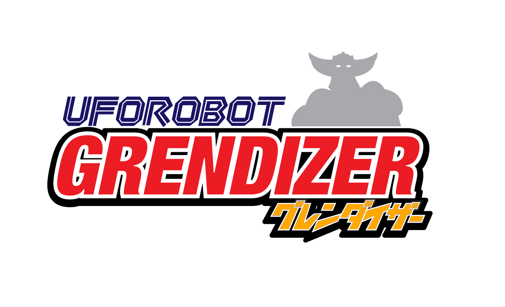

# 🤖 Goldorak Database — Base de données complète de l'univers Goldorak


Une application web full-stack moderne pour gérer et explorer l'univers de Goldorak (UFO Robot Grendizer).
Cette base de données interactive permet de cataloguer et consulter tous les personnages, robots, vaisseaux, armes, épisodes et monstres de la série légendaire.



---

## 📑 Table des matières

- [✨ Fonctionnalités](#-fonctionnalités)
- [🎯 Sections principales](#-sections-principales)
- [🏗️ Architecture du projet](#️-architecture-du-projet)
- [🔧 Technologies utilisées](#-technologies-utilisées)
- [🔑 Prérequis](#-prérequis)
- [📦 Installation & Démarrage](#-installation--démarrage)
  - [🐳 Avec Docker (recommandé)](#-avec-docker-recommandé)
  - [🛠️ En développement local (sans Docker)](#️-en-développement-local-sans-docker)
- [🐳 Architecture Docker](#-architecture-docker)
  - [Services Docker Compose](#services-docker-compose)
  - [Fichiers Docker](#fichiers-docker)
  - [Variables d'environnement](#variables-denvironnement)
  - [Commandes Docker utiles](#commandes-docker-utiles)
  - [Arrêt & Nettoyage](#arrêt--nettoyage)
- [🔐 Authentification OAuth2](#-authentification-oauth2)
- [📚 Structure de la base de données](#-structure-de-la-base-de-données)
- [🎨 Interface utilisateur](#-interface-utilisateur)
- [🔌 API REST](#-api-rest)
- [⚙️ Configuration](#️-configuration)
- [📝 Scripts disponibles](#-scripts-disponibles)
- [🤝 Contribution](#-contribution)
- [📄 Licence](#-licence)

---

## ✨ Fonctionnalités

### 🎭 Gestion complète des données
- ✅ **CRUD complet** pour toutes les entités (Créer, Lire, Modifier, Supprimer)
- ✅ **Recherche et filtrage** avancés
- ✅ **Validation des données** côté client et serveur
- ✅ **Relations entre entités** (personnages ↔ robots, robots ↔ armes, etc.)
- ✅ **Gestion des doublons** automatique

### 🔐 Authentification OAuth2
- 🔑 **Google OAuth** — Connexion avec compte Google
- 🔑 **GitHub OAuth** — Connexion avec compte GitHub
- 🔑 **JWT Tokens** — Gestion sécurisée des sessions
- 🔑 **Routes protégées** — Accès sécurisé à l'application

### 🎨 Interface moderne
- 🌌 **Design spatial thématique** inspiré de l'univers Goldorak
- 📱 **Responsive Design** — Compatible mobile, tablette et desktop
- 🎯 **Navigation par onglets** intuitive
- 💫 **Animations fluides** et transitions CSS
- 🌈 **Palette de couleurs** cyan, rouge, orange (couleurs iconiques de Goldorak)

### 📊 Tableau de bord
- 📈 **Statistiques en temps réel** du nombre d'entrées par catégorie
- 🔄 **Actualisation automatique** des données
- 🟢 **Statut de l'API** en temps réel
- 👤 **Informations utilisateur** avec photo de profil

### 🐳 Conteneurisation Docker
- 🏗️ **3 services orchestrés** (MySQL, Backend, Frontend) via Docker Compose
- 🔄 **Hot-reload** en développement (volumes montés)
- 🏥 **Health check** automatique — le backend attend MySQL avant de démarrer
- 🚀 **Build multi-stage** Nginx pour la production frontend

---

## 🎯 Sections principales

### 👥 Personnages
Gérez tous les personnages de la série.

**Champs disponibles :**
- 📝 Nom français / japonais
- 🎭 Rôle (Héros, Allié, Antagoniste, etc.)
- 🌍 Faction (Terre, Véga, Neutre)
- 🎂 Âge
- 📄 Description détaillée

**Fonctionnalités :**
- Affichage des badges de faction avec couleurs distinctives
- Tri et recherche par nom
- Vue détaillée avec toutes les informations
- Modification et suppression sécurisées

---

### 🤖 Robots & Méchas
Cataloguez tous les robots de combat.

**Champs disponibles :**
- 📝 Nom français / japonais
- 👤 Pilote (relation avec Personnages)
- 🏷️ Type de robot (Combat, Transformable, Transport, etc.)
- 📏 Hauteur (en mètres)
- ⚖️ Poids (en tonnes)
- 📄 Description complète

**Fonctionnalités :**
- Sélection du pilote avec format "ID X = Nom"
- Types prédéfinis avec dropdown
- Badges colorés par type
- Affichage des spécifications techniques

---

### 🚀 Vaisseaux
Répertoriez tous les vaisseaux spatiaux et terrestres.

**Champs disponibles :**
- 📝 Nom français / japonais
- 🚀 Type (Vaisseau-mère, Croiseur, Submersible, etc.)
- 👤 Pilote (optionnel)
- 🌍 Faction (Terre, Véga, Neutre)
- 📄 Description

**Fonctionnalités :**
- Classification par type avec badges
- Affichage de la faction avec couleurs
- Option "Aucun" pour les vaisseaux automatiques
- Liens avec les personnages pilotes

---

### ⚔️ Armes de Goldorak
Documentez toutes les armes et attaques spéciales.

**Champs disponibles :**
- 📝 Nom français / japonais
- 🤖 Robot associé (relation)
- ⚡ Puissance (texte descriptif)
- 📊 Fréquence d'utilisation (Très Fréquente → Très Rare)
- 📄 Description de l'attaque

**Fonctionnalités :**
- Sélection du robot propriétaire
- Fréquence avec badges colorés :
  - 🔴 Très Fréquente
  - 🟠 Fréquente
  - 🟡 Occasionnelle
  - 🟢 Rare
- Descriptions détaillées avec tooltip

---

### 📺 Épisodes
Suivez tous les épisodes de la série.

**Champs disponibles :**
- 📝 Titre français / japonais
- 🔢 Numéro épisode JP / FR
- 🗓️ Date de diffusion JP / FR
- 📋 Résumé + Description complète
- ✅ Statut de diffusion FR

**Fonctionnalités :**
- Calcul automatique de la saison
- Badges de statut de diffusion
- Colonne Description avec aperçu tronqué
- Timeline des diffusions

---

### 🐉 Monstres & Ennemis
Recensez tous les adversaires et monstres.

**Champs disponibles :**
- 📝 Nom français / japonais
- 📺 Épisode d'apparition (relation)
- 🏷️ Type (Monstre, Robot, Vaisseau)
- 📏 Taille (en mètres) + ⚡ Puissance
- 📄 Description

**Fonctionnalités :**
- Lien avec l'épisode d'apparition
- Classification par type
- Spécifications physiques
- Recherche par épisode

---

```
# 🏗️ Architecture Complète du Projet Goldorak

## 📁 Structure du Répertoire Principal
```
```
Goldorak-DB-react-NodeJS-tailwind/
│
├── 📁 backend/                          # 🔌 Serveur Node.js + Express
│   ├── 📁 config/                       # Configuration générale
│   │   └── 🔐 passport.js              # Configuration OAuth2 (Google, GitHub)
│   │
│   ├── 📁 database/                     # Schémas et données SQL
│   │   └── 📊 users.sql                # Schéma table utilisateurs OAuth
│   │
│   ├── 📁 middlewares/                  # Middlewares Express
│   │   ├── 🛡️ authMiddleware.js        # Protection des routes (JWT verification)
│   │   └── ✔️ validation.js             # Validation des données entrantes
│   │
│   ├── 📁 routes/                       # Routes API REST
│   │   ├── 🔐 auth.js                   # Routes authentification OAuth2
│   │   ├── 👥 personnages.js            # CRUD Personnages (GET, POST, PATCH, DELETE)
│   │   ├── 🤖 robots.js                 # CRUD Robots & Méchas
│   │   ├── 🚀 vaisseaux.js              # CRUD Vaisseaux spatiaux
│   │   ├── ⚔️ armes.js                  # CRUD Armes & attaques spéciales
│   │   ├── 📺 episodes.js               # CRUD Épisodes
│   │   └── 🐉 monstres.js               # CRUD Monstres & ennemis
│   │
│   ├── 📁 public/                       # Fichiers statiques (optionnel)
│   │   ├── 📄 index.html                # Page statique de test
│   │   ├── 📝 script.js                 # Scripts côté client test
│   │   └── 🎨 style.css                 # Styles test
│   │
│   ├── 🐳 Dockerfile                    # Image Node.js production
│   ├── 🐳 Dockerfile.dev                # Image Node.js développement
│   ├── 🔒 .env.example                  # Template variables d'environnement
│   ├── 🚀 index.js                      # Point d'entrée serveur Express
│   ├── 📦 package.json                  # Dépendances & scripts npm
│   └── 📦 package-lock.json             # Verrouillage versions dépendances
│
├── 📁 frontend/                         # ⚛️ Application React + Vite
│   ├── 📁 src/                          # Code source React
│   │   ├── 📁 assets/                   # Images, logos, ressources
│   │   │   └── 🎨 GrendizerLogo.png     # Logo Goldorak
│   │   │
│   │   ├── 📁 components/               # Composants React réutilisables
│   │   │   ├── 🔐 Login.jsx             # Page connexion OAuth2
│   │   │   ├── 🔄 AuthCallback.jsx      # Gestion callback OAuth
│   │   │   ├── 🛡️ ProtectedRoute.jsx    # Wrapper routes protégées
│   │   │   ├── 📋 Header.jsx            # En-tête avec infos utilisateur
│   │   │   ├── 🔔 LoadingSpinner.jsx    # Spinner de chargement
│   │   │   ├── 📝 Modal.jsx             # Modal CRUD universel
│   │   │   ├── 💬 DescriptionCell.jsx   # Tooltip descriptions détaillées
│   │   │   ├── 👥 Personnages.jsx       # Gestion des personnages
│   │   │   ├── 🤖 Robots.jsx            # Gestion des robots
│   │   │   ├── 🚀 Vaisseaux.jsx         # Gestion des vaisseaux
│   │   │   ├── ⚔️ Armes.jsx             # Gestion des armes
│   │   │   ├── 📺 Episodes.jsx          # Gestion des épisodes
│   │   │   └── 🐉 Monstres.jsx          # Gestion des monstres
│   │   │
│   │   ├── 📁 context/                  # Contextes React globaux
│   │   │   └── 🔐 AuthContext.jsx       # Contexte authentification utilisateur
│   │   │
│   │   ├── 📁 hooks/                    # Hooks React personnalisés
│   │   │   ├── 🎣 useFetchData.js       # Hook CRUD générique (GET, POST, PATCH, DELETE)
│   │   │   ├── 📋 useFormFields.js      # Configuration dynamique formulaires
│   │   │   └── 🔗 useReferenceData.js   # Chargement données référence (listes dropdown)
│   │   │
│   │   ├── 📁 styles/                   # Fichiers CSS spécifiques
│   │   │   ├── 💄 Header.css            # Styles en-tête
│   │   │   ├── 🔐 Login.css             # Styles page connexion
│   │   │   └── 🎨 Components.css        # Styles composants réutilisables
│   │   │
│   │   ├── 🔌 api.js                    # Client API REST (axios/fetch wrapper)
│   │   ├── 📱 App.jsx                   # Composant principal app
│   │   ├── 🔐 AppWithAuth.jsx           # Wrapper avec authentification
│   │   ├── 💄 App.css                   # Styles globaux app
│   │   ├── 💄 index.css                 # Styles globaux page
│   │   └── 🚀 main.jsx                  # Point d'entrée React
│   │
│   ├── 📁 public/                       # Fichiers statiques publics
│   │   └── 🎯 favicon.ico               # Icône du site
│   │
│   ├── 🐳 Dockerfile                    # Image Nginx production (build multi-stage)
│   ├── 🐳 Dockerfile.dev                # Image Vite développement
│   ├── 📄 index.html                    # Page HTML entry point
│   ├── 🔒 .env.example                  # Template variables d'environnement frontend
│   ├── 📦 package.json                  # Dépendances & scripts npm
│   ├── 📦 package-lock.json             # Verrouillage versions dépendances
│   ├── ⚡ vite.config.js                # Configuration Vite build tool
│   └── 📋 eslint.config.js              # Configuration linter ESLint
│
├── 📁 mysql/                            # 🗄️ Base de données
│   └── 📊 init.sql                      # Schéma complet + données de démo
│
├── 🐳 docker-compose.yml                # Orchestration 3 services (MySQL, Backend, Frontend)
├── 🐳 Dockerfile                        # Dockerfile racine (si multi-project)
├── 🔒 .env.example                      # Template variables d'environnement Docker
├── 📋 .gitignore                        # Fichiers ignorés par Git
├── 📄 README.md                         # Documentation principale (format markdown)
├── 📄 README Docker.md                  # Documentation Docker (ce fichier)
└── 🔐 OAUTH2_SETUP.md                   # Guide configuration OAuth2 détaillé
```

---

## 🔧 Technologies utilisées

### Backend
| Package | Version  | Rôle |
|---------|----------|------|
| Node.js | ≥ 20.0.0 | Runtime JavaScript |
| Express | ^5.2.1   | Framework web |
| MySQL2 | ^3.16.3  | Driver MySQL avec Promises |
| Passport.js | ^0.7.0   | OAuth2 (Google + GitHub) |
| express-validator | ^7.3.1   | Validation des données |
| express-session | —        | Gestion des sessions |
| jsonwebtoken | ^9.0.3   | JWT |
| cors | ^2.8.6   | Cross-Origin Resource Sharing |
| dotenv | ^17.2.3  | Variables d'environnement |

### Frontend
| Package | Version | Rôle |
|---------|---------|------|
| React | ^19.2.0 | Bibliothèque UI |
| React Router DOM | ^7.13.0 | Routage côté client |
| Vite | 7.2.5 | Build tool ultra-rapide |
| Tailwind CSS | — | Framework CSS utilitaire |

### Infrastructure
| Outil | Version | Rôle |
|-------|---------|------|
| MySQL | 8.0 | SGBD relationnel |
| Docker | ≥ 24.x | Conteneurisation |
| Docker Compose | ≥ 2.x | Orchestration multi-services |
| Nginx | stable-alpine | Serveur web production |

---

## 🔑 Prérequis

**Pour Docker (recommandé) :**
- ✅ **Docker Desktop** ≥ 24.x
- ✅ **Docker Compose** ≥ 2.x
- ✅ Clés OAuth2 Google et/ou GitHub *(optionnel)*

**Pour le développement local (sans Docker) :**
- ✅ **Node.js** ≥ 20.0.0 ([Télécharger](https://nodejs.org/))
- ✅ **MySQL** ≥ 8.0 ([Télécharger](https://dev.mysql.com/downloads/))
- ✅ **Git** ([Télécharger](https://git-scm.com/))

---

## 📦 Installation & Démarrage

### 🐳 Avec Docker (recommandé)

```bash
# 1. Cloner le dépôt
git clone https://github.com/Septieme7/Goldorak-DB-react-NodeJS-tailwind.git
cd Goldorak-DB-react-NodeJS-tailwind

# 2. Copier et configurer les variables d'environnement
cp .env.example .env
# ⚠️ Éditer .env avec tes propres secrets (voir section Variables d'environnement)

# 3. Construire et démarrer tous les services
docker compose up --build -d

# 4. Vérifier que tout est en ligne
docker compose ps
```

> 🟢 **Accès aux services :**
> - Frontend (dev) : http://localhost:5173
> - Backend API   : http://localhost:8800/api/v1
> - MySQL         : localhost:3306

---

### 🛠️ En développement local (sans Docker)

#### Étape 1 — Backend

```bash
cd backend
npm install

# Copier et remplir le fichier .env local
cp .env.example .env

# Démarrage en développement
npm run dev
```

#### Étape 2 — Base de données

Créer manuellement la base via `mysql/init.sql` :

```bash
mysql -u root -p < mysql/init.sql
```

Ou via le client MySQL :

1. **Créer la base de données MySQL :**

```sql
CREATE DATABASE goldorak_db CHARACTER SET utf8mb4 COLLATE utf8mb4_unicode_ci;
USE goldorak_db;
-- Puis exécuter le contenu de mysql/init.sql
```

2. **Créer les tables :**

```sql
-- Table Personnages
CREATE TABLE personnages (
    id INT AUTO_INCREMENT PRIMARY KEY,
    nom_fr VARCHAR(100) NOT NULL,
    nom_jp VARCHAR(100),
    faction VARCHAR(50),
    role VARCHAR(100),
    age INT,
    description TEXT
);

-- Table Robots
CREATE TABLE robots (
    id INT AUTO_INCREMENT PRIMARY KEY,
    nom_fr VARCHAR(100) NOT NULL,
    nom_jp VARCHAR(100),
    pilote_id INT,
    type_robot VARCHAR(100),
    hauteur DECIMAL(5,2),
    poids DECIMAL(6,2),
    description TEXT,
    FOREIGN KEY (pilote_id) REFERENCES personnages(id) ON DELETE SET NULL
);

-- Table Vaisseaux
CREATE TABLE vaisseaux (
    id INT AUTO_INCREMENT PRIMARY KEY,
    nom_fr VARCHAR(100) NOT NULL,
    nom_jp VARCHAR(100),
    type_vaisseau VARCHAR(100),
    pilote_id INT,
    faction VARCHAR(50),
    description TEXT,
    FOREIGN KEY (pilote_id) REFERENCES personnages(id) ON DELETE SET NULL
);

-- Table Armes
CREATE TABLE armes (
    id INT AUTO_INCREMENT PRIMARY KEY,
    nom_fr VARCHAR(100) NOT NULL,
    nom_jp VARCHAR(100),
    robot_id INT,
    puissance VARCHAR(100),
    frequence_utilisation VARCHAR(50),
    description TEXT,
    FOREIGN KEY (robot_id) REFERENCES robots(id) ON DELETE CASCADE
);

-- Table Épisodes
CREATE TABLE episodes (
    id INT AUTO_INCREMENT PRIMARY KEY,
    titre_fr VARCHAR(200) NOT NULL,
    titre_jp VARCHAR(200),
    numero_fr INT,
    numero_jp INT NOT NULL,
    diffuse_jp DATE,
    diffuse_fr DATE,
    resume TEXT,
    description TEXT
);

-- Table Monstres
CREATE TABLE monstres (
    id INT AUTO_INCREMENT PRIMARY KEY,
    nom_fr VARCHAR(100) NOT NULL,
    nom_jp VARCHAR(100),
    episode_id INT,
    type_monstre VARCHAR(50),
    taille DECIMAL(5,2),
    puissance VARCHAR(100),
    description TEXT,
    FOREIGN KEY (episode_id) REFERENCES episodes(id) ON DELETE SET NULL
);

-- Table Utilisateurs (OAuth)
CREATE TABLE users (
    id INT AUTO_INCREMENT PRIMARY KEY,
    oauth_id VARCHAR(255) NOT NULL UNIQUE,
    oauth_provider ENUM('google', 'github') NOT NULL,
    email VARCHAR(255) NOT NULL,
    display_name VARCHAR(255),
    photo_url VARCHAR(500),
    created_at TIMESTAMP DEFAULT CURRENT_TIMESTAMP,
    last_login TIMESTAMP DEFAULT CURRENT_TIMESTAMP ON UPDATE CURRENT_TIMESTAMP
);
```

#### Étape 3 — Frontend

```bash
cd frontend
npm install
cp .env.example .env
# VITE_API_URL=http://localhost:8800/api/v1
npm run dev
```

> L'application démarre sur **http://localhost:5173**

#### Mode production (sans Docker)

```bash
# Backend
cd backend && npm start

# Frontend — build puis prévisualisation
cd frontend
npm run build
npm run preview
```

---

## 🐳 Architecture Docker

### Services Docker Compose

Le fichier `docker-compose.yml` orchestre **3 services** :

#### 🗄️ Service `db` — MySQL 8.0
```yaml
image: mysql:8.0
container_name: goldorak-db
ports: "3306:3306"
```
- Persistance des données via le volume nommé `mysql_data`
- Initialisation automatique du schéma via `mysql/init.sql`
- **Health check** intégré — les services dépendants attendent MySQL avant de démarrer

#### ⚙️ Service `backend` — Node.js / Express
```yaml
build: ./backend
container_name: goldorak-backend
ports: "8800:8800"
depends_on:
  db:
    condition: service_healthy   # ← attend le health check MySQL
```
- Variables d'environnement injectées depuis `.env`
- Volume monté sur `./backend:/app` pour le hot-reload en développement

#### 🖥️ Service `frontend` — Vite (dev) ou Nginx (prod)
```yaml
build:
  context: ./frontend
  dockerfile: Dockerfile.dev     # ← Vite dev server (port 5173)
container_name: goldorak-frontend
ports: "5173:5173"
```
> 💡 **Passage en production :** remplacer `Dockerfile.dev` par `Dockerfile`
> (build Vite → Nginx, port `5173` → `80`).

---

### Fichiers Docker

#### `backend/Dockerfile` — Production Node.js
```dockerfile
FROM node:20-alpine
WORKDIR /app
COPY package*.json ./
RUN npm ci          # Install propre (respecte package-lock.json)
COPY . .
EXPOSE 8800
CMD ["node", "index.js"]
```

#### `frontend/Dockerfile.dev` — Dev Vite
```dockerfile
FROM node:20-alpine
WORKDIR /app
COPY package*.json ./
RUN npm install
COPY . .
EXPOSE 5173
CMD ["npm", "run", "dev", "--", "--host", "0.0.0.0"]
```

#### `frontend/Dockerfile` — Production Nginx (build multi-stage)
```dockerfile
# ── Étape 1 : Build React ────────────────────────────────
FROM node:20-alpine AS builder
WORKDIR /app
COPY package*.json ./
RUN npm ci
COPY . .
RUN npm run build          # Génère /app/dist

# ── Étape 2 : Servir avec Nginx ─────────────────────────
FROM nginx:stable-alpine
COPY --from=builder /app/dist /usr/share/nginx/html
EXPOSE 80
CMD ["nginx", "-g", "daemon off;"]
```

---

### Variables d'environnement

Copier `.env.example` → `.env` et remplir les valeurs :

```dotenv
# ── MySQL ──────────────────────────────────────────────────
MYSQL_ROOT_PASSWORD=rootpassword      # Mot de passe root MySQL
MYSQL_DATABASE=goldorak_db            # Nom de la base
MYSQL_USER=app_user                   # Utilisateur applicatif
MYSQL_PASSWORD=app_password           # Son mot de passe

# ── Backend ────────────────────────────────────────────────
PORT=8800                             # Port du serveur Express
NODE_ENV=production                   # production | development
FRONTEND_URL=http://localhost         # URL du frontend (CORS)
CORS_ORIGIN=http://localhost          # Origine autorisée

# ── Sécurité ───────────────────────────────────────────────
SESSION_SECRET=un_secret_long_et_aleatoire_pour_les_sessions
JWT_SECRET=un_autre_secret_pour_jwt
JWT_EXPIRES_IN=7d

# ── OAuth2 Google (optionnel) ──────────────────────────────
GOOGLE_CLIENT_ID=votre_client_id
GOOGLE_CLIENT_SECRET=votre_secret
GOOGLE_CALLBACK_URL=http://localhost:8800/api/v1/auth/google/callback

# ── OAuth2 GitHub (optionnel) ──────────────────────────────
GITHUB_CLIENT_ID=votre_client_id
GITHUB_CLIENT_SECRET=votre_secret
GITHUB_CALLBACK_URL=http://localhost:8800/api/v1/auth/github/callback
```

> **Frontend** (dans `frontend/.env`) :
> ```dotenv
> VITE_API_URL=http://localhost:8800/api/v1
> ```

---

### Commandes Docker utiles

```bash
# ── Cycle de vie ───────────────────────────────────────────

# Démarrer tous les services (en arrière-plan)
docker compose up -d

# Reconstruire après modification du code ou du Dockerfile
docker compose up --build -d

# Voir l'état des conteneurs
docker compose ps

# ── Logs ───────────────────────────────────────────────────

# Logs de tous les services en temps réel
docker compose logs -f

# Logs d'un service spécifique
docker compose logs -f backend
docker compose logs -f frontend
docker compose logs -f db

# ── Base de données ────────────────────────────────────────

# Accéder à MySQL dans le conteneur
docker exec -it goldorak-db mysql -u app_user -p goldorak_db

# Réinitialiser la base de données (perte de données !)
docker compose down -v && docker compose up --build -d

# ── Tests API rapides (curl) ───────────────────────────────

# Santé de l'API
curl http://localhost:8800/api/v1/health

# Lister les personnages
curl http://localhost:8800/api/v1/personnages

# Statistiques globales
curl http://localhost:8800/api/v1/stats
```

---

### Arrêt & Nettoyage

```bash
# Arrêter les services (données conservées)
docker compose down

# Arrêter ET supprimer les volumes (⚠️ efface toute la DB)
docker compose down -v

# Supprimer les images Docker générées localement
docker compose down --rmi local

# Nettoyage complet (images, volumes, networks orphelins)
docker system prune -af --volumes
```

---

## 🔐 Authentification OAuth2

Consultez le fichier `OAUTH2_SETUP.md` pour la configuration complète de Google et GitHub OAuth.

### Flux OAuth2

```
┌─────────────┐
│   Client    │
│  (Browser)  │
└──────┬──────┘
       │
       │ 1. Clic "Se connecter avec Google/GitHub"
       ▼
┌─────────────────────┐
│   Frontend React    │
│  /login page        │
└──────┬──────────────┘
       │
       │ 2. Redirection vers /api/v1/auth/google (ou /github)
       ▼
┌─────────────────────┐
│   Backend Express   │
│  (Passport.js)      │
└──────┬──────────────┘
       │
       │ 3. Redirection vers Google/GitHub OAuth
       ▼
┌─────────────────────┐
│  Google / GitHub    │
│  OAuth Server       │
└──────┬──────────────┘
       │
       │ 4. Utilisateur s'authentifie
       │ 5. Callback vers backend /auth/callback
       ▼
┌─────────────────────┐
│   Backend Express   │
│  /auth/callback     │
└──────┬──────────────┘
       │
       │ 6. Génération JWT Token
       │ 7. Redirection vers /auth/callback?token=...
       ▼
┌─────────────────────┐
│   Frontend React    │
│  /auth/callback     │
└──────┬──────────────┘
       │
       │ 8. Vérification token
       │ 9. Stockage localStorage
       │ 10. Redirection vers /
       ▼
┌─────────────────────┐
│   Application       │
│   Authentifiée ✅  │
└─────────────────────┘
```

### Endpoints d'authentification (non protégés)

| Méthode | Endpoint | Description |
|---------|----------|-------------|
| `GET` | `/auth/google` | Initier l'auth Google |
| `GET` | `/auth/google/callback` | Callback Google |
| `GET` | `/auth/github` | Initier l'auth GitHub |
| `GET` | `/auth/github/callback` | Callback GitHub |
| `GET` | `/auth/verify` | Vérifier un token JWT |
| `GET` | `/auth/logout` | Déconnexion |
| `GET` | `/auth/me` | Profil utilisateur courant |

### Sécurité

- ✅ **Tokens JWT** avec expiration (7 jours par défaut)
- ✅ **Routes protégées** avec middleware d'authentification
- ✅ **CORS configuré** pour empêcher les requêtes non autorisées
- ✅ **Validation des données** côté client et serveur
- ✅ **Sessions sécurisées** avec express-session
- ✅ **Cookies sécurisés** en mode production (`secure: true`)

---

## 📚 Structure de la base de données

### Schéma des relations

```
┌─────────────────┐
│  personnages    │
│─────────────────│
│ • id (PK)       │◄────┐
│ • nom_fr        │     │
│ • nom_jp        │     │
│ • faction       │     │
│ • role          │     │
│ • age           │     │
│ • description   │     │
└─────────────────┘     │
                        │ pilote_id (FK)
                        │
┌─────────────────┐     │
│     robots      │     │
│─────────────────│     │
│ • id (PK)       │◄────┼────┐
│ • nom_fr        │     │    │
│ • pilote_id (FK)├─────┘    │
│ • type_robot    │          │
│ • hauteur       │          │
│ • poids         │          │ robot_id (FK)
│ • description   │          │
└─────────────────┘          │
                             │
┌─────────────────┐          │
│      armes      │          │
│─────────────────│          │
│ • id (PK)       │          │
│ • nom_fr        │          │
│ • robot_id (FK) ├──────────┘
│ • puissance     │
│ • frequence     │
│ • description   │
└─────────────────┘

┌─────────────────┐
│    vaisseaux    │
│─────────────────│
│ • id (PK)       │
│ • nom_fr        │
│ • pilote_id (FK)├─────┐
│ • type_vaisseau │     │
│ • faction       │     │
│ • description   │     └──► personnages
└─────────────────┘

┌─────────────────┐
│    episodes     │
│─────────────────│
│ • id (PK)       │◄────┐
│ • titre_fr      │     │
│ • numero_jp     │     │
│ • numero_fr     │     │
│ • diffuse_jp    │     │
│ • diffuse_fr    │     │
│ • resume        │     │ episode_id (FK)
│ • description   │     │
└─────────────────┘     │
                        │
┌─────────────────┐     │
│    monstres     │     │
│─────────────────│     │
│ • id (PK)       │     │
│ • nom_fr        │     │
│ • episode_id(FK)├─────┘
│ • type_monstre  │
│ • taille        │
│ • puissance     │
│ • description   │
└─────────────────┘

users (OAuth2 — table indépendante)
```

### Tables

| Table | Description | Clés étrangères |
|-------|-------------|-----------------|
| `personnages` | Héros et ennemis de la série | — |
| `robots` | Robots de combat | `pilote_id → personnages` |
| `armes` | Arsenal des robots | `robot_id → robots` (CASCADE DELETE) |
| `vaisseaux` | Vaisseaux spatiaux | `pilote_id → personnages` |
| `episodes` | Épisodes de la série | — |
| `monstres` | Mécabêtes de Véga | `episode_id → episodes` |
| `users` | Utilisateurs OAuth2 | — |

> ⚠️ **Contraintes d'intégrité :**
> - Impossible de supprimer un **personnage** lié à un robot ou un vaisseau
> - Impossible de supprimer un **robot** lié à des armes
> - Impossible de supprimer un **épisode** lié à des monstres
> - Le charset `utf8mb4` est utilisé pour le support des caractères japonais (名前)

### SQL complet

Le schéma complet avec les données de démonstration est disponible dans `mysql/init.sql`.
Il est exécuté automatiquement au premier démarrage du conteneur MySQL.

---

## 🎨 Interface utilisateur

### Palette de couleurs

```css
--goldorak-space:  #0a0a2a   /* Bleu spatial foncé  */
--goldorak-blue:   #1a4b8c   /* Bleu Goldorak        */
--goldorak-red:    #ff2e2e   /* Rouge énergétique    */
--goldorak-orange: #ff8c00   /* Orange vibrant       */
--goldorak-yellow: #ffd700   /* Jaune doré           */
--goldorak-energy: #00ffea   /* Cyan électrique      */
--goldorak-light:  #e0e0e0   /* Gris clair           */
--goldorak-silver: #b0b0b0   /* Argent métallique    */
```
## 🎵 Lecteur musical intégré

Le projet intègre un **lecteur audio léger** aux couleurs de Goldorak, permettant d’écouter 4 titres emblématiques de la série pendant l’utilisation de l’interface.

### Fonctionnalités

| Commande | Icône | Action |
|----------|-------|--------|
| Lecture / Pause | ▶️ / ⏸ | Joue ou met en pause la piste courante |
| Piste précédente | ⏮ | Retour au titre précédent |
| Piste suivante | ⏭ | Passe au titre suivant |
| Playlist | 📀 | Menu déroulant pour sélectionner directement un morceau |

### Fichiers audio

Placez vos 4 fichiers `.mp3` dans le dossier :  
`frontend/public/musiques/`

Noms attendus (ajustables dans `MusicPlayer.jsx`) :
- `goldorak-generique.mp3`
- `actarus-deploie-toi.mp3`
- `combat-spatial.mp3`
- `vega-attaque.mp3`

### Intégration technique

- **Composant** : `MusicPlayer.jsx` – aucune dépendance externe (API HTML5 Audio)
- **Styles** : `MusicPlayer.css` – thème spatial (cyan, rouge, fonds transparents)
- **Position** : en haut à droite de l’en-tête principal (à côté du logo Goldorak)
- **Volume** : réglé à 50 % par défaut, réglable via le code si besoin

### Composants principaux

#### 🎯 Modal universel
- Formulaires dynamiques générés automatiquement
- Validation en temps réel
- 3 modes : Créer / Modifier / Voir détails
- Design spatial avec fond d'étoiles
- Animations fluides d'ouverture/fermeture

#### 📊 Tableaux de données
- Tri par colonnes
- Actions rapides (Voir / Modifier / Supprimer)
- Badges colorés pour les catégories
- Descriptions avec tooltip au clic
- Responsive avec scroll horizontal mobile

#### 💬 Tooltip descriptions
- Activation au clic sur texte tronqué
- Affichage centré au premier plan (`z-index: 99999`)
- Fermeture automatique au scroll
- Fermeture par clic sur overlay ou croix
- Texte agrandi pour meilleure lisibilité

#### 🎛️ Dashboard
- Cartes statistiques animées
- Statut API en temps réel
- Actualisation manuelle ou automatique
- Design responsive grid

---

## 🔌 API REST

### Base URL
```
http://localhost:8800/api/v1
```

> Toutes les routes (sauf `/auth/*` et `/health`) sont **protégées par JWT**.
> Ajouter le header : `Authorization: Bearer <token>`

### Authentification

#### Connexion Google
```
GET /auth/google
```
Redirige vers l'authentification Google OAuth2.

#### Connexion GitHub
```
GET /auth/github
```
Redirige vers l'authentification GitHub OAuth2.

#### Vérifier un token
```
GET /auth/verify
Headers: Authorization: Bearer <token>
```

**Réponse :**
```json
{
  "success": true,
  "user": {
    "id": 1,
    "email": "user@example.com",
    "displayName": "John Doe",
    "provider": "google"
  }
}
```

### Routes CRUD (pattern générique)
Toutes les entités suivent le même pattern :

| Méthode | Endpoint | Description |
|---------|----------|-------------|
| `GET` | `/{entité}` | Liste tous les éléments |
| `GET` | `/{entité}/:id` | Détail d'un élément |
| `POST` | `/{entité}` | Créer un élément |
| `PATCH` | `/{entité}/:id` | Modifier partiellement |
| `DELETE` | `/{entité}/:id` | Supprimer |

### Entités disponibles

| Entité | Route | Description |
|--------|-------|-------------|
| 👥 Personnages | `/personnages` | Héros et ennemis |
| 🤖 Robots | `/robots` | Robots de combat |
| 🚀 Vaisseaux | `/vaisseaux` | Vaisseaux spatiaux |
| ⚔️ Armes | `/armes` | Arsenal de Goldorak |
| 📺 Épisodes | `/episodes` | Épisodes de la série |
| 🐉 Monstres | `/monstres` | Mécabêtes de Véga |
| 📊 Stats | `/stats` | Comptage global |
| 🏥 Health | `/health` | Santé de l'API + DB |

#### Récupérer un élément par ID
```
GET /{entité}/{id}
Headers: Authorization: Bearer <token>
```

#### Créer un élément
```
POST /{entité}
Headers:
  Authorization: Bearer <token>
  Content-Type: application/json
Body: {JSON avec les champs}
```

#### Modifier un élément (partiel)
```
PATCH /{entité}/{id}
Headers:
  Authorization: Bearer <token>
  Content-Type: application/json
Body: {JSON avec les champs à modifier}
```

#### Remplacer un élément (complet)
```
PUT /{entité}/{id}
Headers:
  Authorization: Bearer <token>
  Content-Type: application/json
Body: {JSON complet}
```

#### Supprimer un élément
```
DELETE /{entité}/{id}
Headers: Authorization: Bearer <token>
```

### Valeurs d'énumération

| Champ | Valeurs acceptées |
|-------|------------------|
| `faction` | `"Terre"` \| `"Véga"` \| `"Neutre"` |
| `type_monstre` | `"Robot"` \| `"Monstre"` \| `"Vaisseau"` |
| `frequence_utilisation` | `"Très Fréquente"` \| `"Fréquente"` \| `"Occasionnelle"` \| `"Assez Rare"` \| `"Rare"` \| `"Très Rare"` |

### Exemples de requêtes

#### Créer un personnage
```bash
curl -X POST http://localhost:8800/api/v1/personnages \
  -H "Authorization: Bearer YOUR_TOKEN" \
  -H "Content-Type: application/json" \
  -d '{
    "nom_fr": "Actarus",
    "nom_jp": "デューク・フリード",
    "faction": "Terre",
    "role": "Héros principal",
    "age": 19,
    "description": "Prince de la planète Euphor"
  }'
  ```

#### Modifier partiellement un robot
```bash
curl -X PATCH http://localhost:8800/api/v1/robots/1 \
  -H "Authorization: Bearer YOUR_TOKEN" \
  -H "Content-Type: application/json" \
  -d '{"hauteur": 30.5, "poids": 280.5}'
  ```

# Vérifier la santé de l'API (sans token)
```bash
curl http://localhost:8800/api/v1/health
```
# Voir les statistiques
```bash
curl -H "Authorization: Bearer YOUR_TOKEN" \
  http://localhost:8800/api/v1/stats
```
---

## ⚙️ Configuration

### Variables d'environnement — Backend

| Variable | Description | Défaut |
|----------|-------------|--------|
| `PORT` | Port du serveur Express | `8800` |
| `NODE_ENV` | Environnement | `development` |
| `DB_HOST` | Hôte MySQL | `localhost` |
| `DB_NAME` | Nom de la base | `goldorak_db` |
| `DB_USER` | Utilisateur MySQL | `root` |
| `DB_PASSWORD` | Mot de passe MySQL | — |
| `DB_PORT` | Port MySQL | `3306` |
| `JWT_SECRET` | Secret JWT | À définir |
| `JWT_EXPIRES_IN` | Durée de validité du token | `7d` |
| `SESSION_SECRET` | Secret de session | À définir |
| `FRONTEND_URL` | URL du frontend (CORS) | `http://localhost:5173` |
| `CORS_ORIGIN` | Origine CORS autorisée | `http://localhost:5173` |

### Variables d'environnement — Frontend

| Variable | Description | Défaut |
|----------|-------------|--------|
| `VITE_API_URL` | URL de l'API backend | `http://localhost:8800/api/v1` |

---

## 📝 Scripts disponibles

### Backend

```bash
# Démarrage mode développement (avec nodemon si configuré)
npm run dev

# Démarrage mode production
npm start

# Tests (à implémenter)
npm test
```

### Frontend

```bash
# Démarrage serveur de développement
npm run dev

# Build pour production
npm run build

# Prévisualisation du build
npm run preview

# Linter analyse statique du code
npm run lint
```

---

## 🥚 Easter Egg — Code Konami

> *Pour les vrais fans de Goldorak... et de jeux vidéo rétro.*

Une surprise secrète est cachée dans l'application. Elle se déclenche sur **n'importe quelle page** de l'interface.

### 🕹️ Comment l'activer ?

Saisissez la séquence légendaire au clavier :

```
↑  ↑  ↓  ↓  ←  →  ←  →  B  A
```

> 🎮 La séquence complète doit être entrée **sans délai trop long** entre chaque touche.
> Fonctionne depuis n'importe quel écran de l'application, sans avoir à cliquer nulle part au préalable.

### ⚙️ Fonctionnement technique

- **Écoute globale** via un `useEffect` sur `window` dans `AppWithAuth.jsx` — actif sur toutes les pages
- **Séquence surveillée** : `ArrowUp ArrowUp ArrowDown ArrowDown ArrowLeft ArrowRight ArrowLeft ArrowRight KeyB KeyA`
- Aucune dépendance externe — 100 % natif React + API `keydown`

### 💡 Indice

> *"Le ciel s'embrase quand Goldorak déploie ses ailes..."*

---

## 🤝 Contribution

Les contributions sont les bienvenues !

1. **Fork** le projet
2. **Créer** une branche pour votre fonctionnalité (`git checkout -b feature/AmazingFeature`)
3. **Commit** vos changements (`git commit -m 'Add some AmazingFeature'`)
4. **Push** vers la branche (`git push origin feature/AmazingFeature`)
5. **Ouvrir** une Pull Request

### Guidelines

- 📝 Commentaires en français dans le code
- ✅ Respecter les conventions de nommage existantes
- 🧪 Tester les modifications avant de soumettre
- 📚 Mettre à jour la documentation si nécessaire

---

## 📄 Licence

Ce projet est sous licence **ISC**.

---

## 👨‍💻 Auteur

Développé avec ❤️ et beaucoup de ☕ pour les fans de Goldorak.

---

## 🙏 Remerciements

- **Go Nagai** — Créateur de l'univers Goldorak
- **Toei Animation** — Studio d'animation
- Tous les fans qui maintiennent la flamme de cette série légendaire

---

## 📞 Support

Pour toute question ou problème :
- 🐛 Ouvrir une issue sur GitHub
- 📧 Contact : lordstiko7@gmail.com

---

<div align="center">

**⚡ Goldorak, Go! ⚡**

*"Nous sommes tous des enfants des étoiles"*


*📅 Dernière mise à jour : Mai 2026 — Goldorak DB v7.7.7*

</div>
